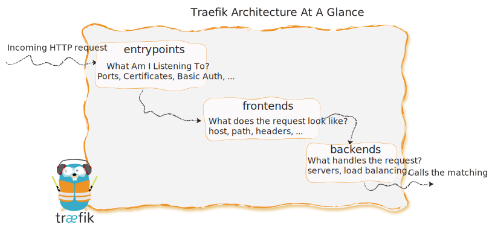

Traefik is an edge router: 
it receives requests on behalf of your system and finds out which component should handle it. 

One of Traefik's core feature is that it discovers _in realtime_ the landscape of your system (what the available components are, their state, where they are located, whether they are healthy or not, their instances, and so on)

 
 - _Entrypoints_ listen for incomming traffic (ports, SSL, ...)
 - _Frontends_ analyse the requests (host, path, headers, ...)
 - _Backends_ forward the request to your services (load balancing, shortcircuits, ...)
 - _Providers_ discover the services that live on your infrastructure (their IP, health, ...)

So in other workds, Traefik uses _entrypoints_, _frontends_, _backends_ and _providers_ to answer the following questions:

Question | Configuration 
---|---
Where does the traffic arrive? | Entrypoints
What do the incoming requests look like? | Frontends
Which machines will handle the requests? | Backends
Where are the machines (containers/services/...)? | Providers